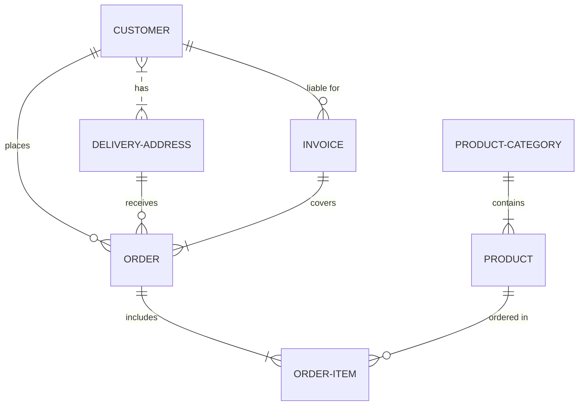

<!--MERMAID {width:100}-->

<!--MCONTENT {content: "erDiagram \nCUSTOMER }|..|{ DELIVERY-ADDRESS : has \nCUSTOMER ||--o{ ORDER : places \nCUSTOMER ||--o{ INVOICE : \"liable for\" \nDELIVERY-ADDRESS ||--o{ ORDER : receives \nINVOICE ||--|{ ORDER : covers \nORDER ||--|{ ORDER-ITEM : includes \nPRODUCT-CATEGORY ||--|{ PRODUCT : contains \nPRODUCT ||--o{ ORDER-ITEM : \"ordered in\" "} --->

 

This file was generated by Swimm. [Click here to view it in the app](https://swimm-web-app.web.app/repos/Z2l0aHViJTNBJTNBdnVlJTNBJTNBdXNlcnRlc3Rpbmctc3dpbW0=/docs/mjuab).
