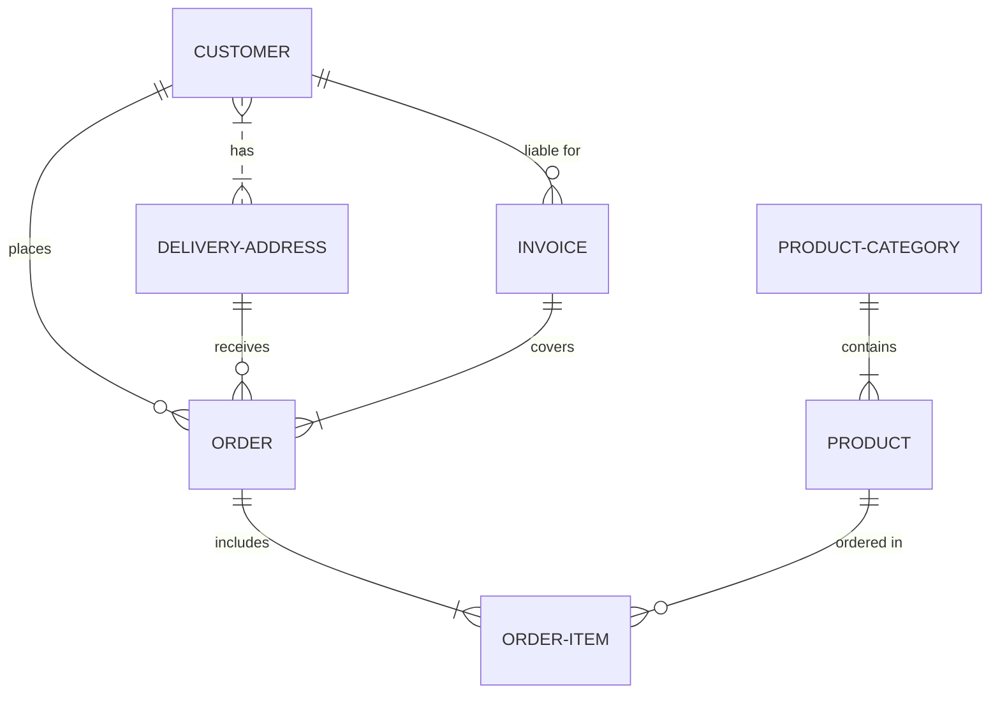

<!--MERMAID {width:100}-->

<!--MCONTENT {content: erDiagram 
CUSTOMER }|..|{ DELIVERY-ADDRESS : has 
CUSTOMER ||--o{ ORDER : places 
CUSTOMER ||--o{ INVOICE : "liable for" 
DELIVERY-ADDRESS ||--o{ ORDER : receives 
INVOICE ||--|{ ORDER : covers 
ORDER ||--|{ ORDER-ITEM : includes 
PRODUCT-CATEGORY ||--|{ PRODUCT : contains 
PRODUCT ||--o{ ORDER-ITEM : "ordered in" } --->

 

This file was generated by Swimm. [Click here to view it in the app](http://localhost:5001/repos/Z2l0aHViJTNBJTNBdnVlJTNBJTNBdXNlcnRlc3Rpbmctc3dpbW0=/docs/mjuab).